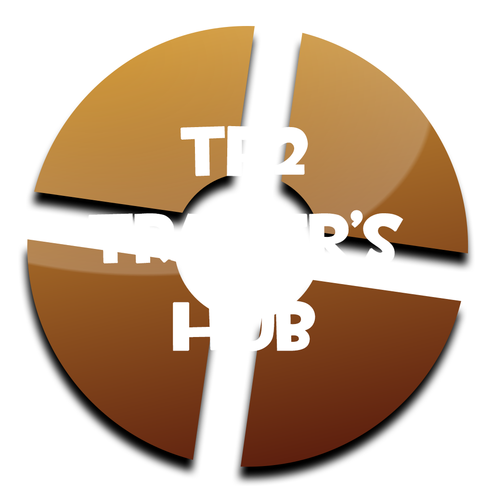

## About

Welcome to TF2 Trader's Hub! This project was developed as part of a college learning initiative, focusing on PHP and Bootstrap 5 technologies. While not intended for real-world deployment, it showcases the skills we've acquired through the creation of a trading website centered around in-game "skin" trading, inspired by the popular video game Team Fortress 2.

## Key Features

### User Authentication and Registration
- Secure user authentication and registration system implemented server-side.
- Input error handling.

### User Profile Management
- Users can easily modify their personal information, including email, password, and avatar.
- Convenient wallet feature allowing users to add funds for simulated transactions.

### Virtual Store
- Simulated store environment where users can purchase items, assuming they have sufficient virtual funds.
- Inventory section enables users to view the items they possess.

### Trading Functionality
- Users can list their items for trade and withdraw them if needed.
- Interactive rating system allows users to rate their trading partners and leave accompanying comments.
- Rating average prominently displayed on user profiles, contributing to a dynamic and engaging trading community.

### Administrative Capabilities
- Admin accounts possess the ability to manage user accounts, including adding or revoking admin status.
- Streamlined admin tools for account management, including account deletion.
- Admins maintain control over the virtual store, with the capability to add, edit, or remove items.
- Message management system empowers admins to read user inquiries and feedback.

### Product Presentation
- Product listings come complete with essential information, such as name, image, rarity, and price.
- Dynamic product presentation featuring color changes based on rarity, enhancing visual appeal.

## Note

This project was designed exclusively for educational purposes and is not intended for real-world use. It serves as a testament to the technical skills acquired during the learning process.

**Disclaimer:** All in-game assets and references to Team Fortress 2 are the intellectual property of Valve Corporation. This project has no affiliation with Valve Corporation and is solely intended for educational purposes.

---
*Project created by Simão Amaral, Marco Moreira for Desenvolvimento de Aplicações Web I at Universidade de Trás-os-Montes e Alto Douro.*
